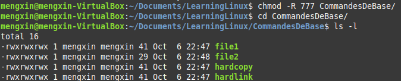
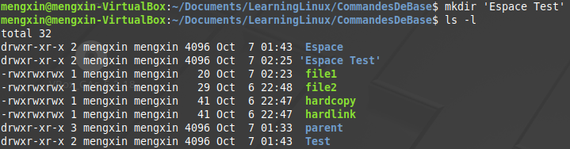
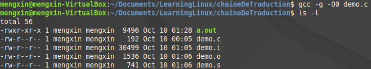

```
---
layout:     post
title:      "Outils utils pour démarrer Linux"
subtitle:   "gestionnaire de fichier, droits d'accès et autres"
date:       2015-10-31 12:00:00
author:     "Mengxin"
header-img: 
tags:
    - Linux
---
```

## 1.Commandes de base - gestionnaire de fichier

### cp(copy) 
Copy a fiche or directory

```


cp [OPTION]… [-T] SOURCE DEST
cp [OPTION]… SOURCE… DIRECTORY
cp [OPTION]… -t DIRECTORY SOURCE…
```
- '-a' or '- -archive'：此选项通常在复制目录时使用，它保留链接、文件属性，并复制目录下的所有内容。其作用等于dpR参数组合。
>**Preserve as much as possible of the structure and attributes of the original files in the copy** (but do not attempt to preserve internal directory structure; i.e., ‘ls -U’ may list the entries in a copied directory in a different order).  Try to preserve SELinux security context and extended attributes (xattr), but ignore any failure to do that and print no corresponding diagnostic.  Equivalent to ‘-dR--preserve=all’ with the reduced diagnostics.

- '-r' or '- -recursive'：若给出的源文件是一个目录文件，此时将复制该目录下所有的子目录和文件。
>Copy directories recursively.  By default, do not follow symbolic links in the source unless used together with the ‘--link’ (‘-l’)  option; **Special files are copied by creating a destination file of the same type as the source;** .  It is not portable to use ‘-r’ to copy symbolic links or special files.  On some non-GNU systems, ‘-r’ implies the equivalent of ‘-L’ and ‘--copy-contents’ for historical reasons.  Also, it is not portable to use ‘-R’ to copy symbolic links unless you also specify ‘-P’, as POSIX allows implementations that dereference symbolic links by default.

La différence entre '-r' et '-a' est que le dernier garde le plus possile la structure de l'ancien répertoire:

On crée une lien physique entre file1 et hardlink dans le répertoire CommandesDeBase

On recopie le répertoire par '-r' et '-a'

Résultat de '-a': On perd le lien entre le file1 et le hardlink.

Résultat de '-a': Le lien physique entre le file1 et le hardlink est préservé.

- -d：复制时保留链接。这里所说的链接相当于Windows系统中的快捷方式。
- -f：覆盖已经存在的目标文件而不给出提示。
- -i：与-f选项相反，在覆盖目标文件之前给出提示，要求用户确认是否覆盖，回答"y"时目标文件将被覆盖。
- -p：除复制文件的内容外，还把修改时间和访问权限也复制到新文件中。


- '-l' or '--link'：不复制文件，而是创建一个硬链接。
>Make hard links instead of copies of **non-directories.** (car on ne peut pas faire des liens durs sur un répertoire)


  


### mv(move)
```
mv [OPTION]… [-T] SOURCE DEST
mv [OPTION]… SOURCE… DIRECTORY
mv [OPTION]… -t DIRECTORY SOURCE…
```
* -i: 若指定目录已有同名文件，则先询问是否覆盖旧文件;
* -f: 在mv操作要覆盖某已有的目标文件时不给任何指示;
```bash
mv [fiche] [fiche]#renomer cette fiche
mv [fiche] [directory]#déplacer cette fiche
mv [directory] [directory]#Si le répertoire destinataire existe, déplacer le répertoire source à ce répertoire; sinon équivalent à "rename"
mv [directory][fiche] #illegal
```


### cd(change directory)
```bash
cd [directoryname]
cd /usr/bin
cd ~ 	 #accéder à home de l'utilisateur
cd ..	#accéder à répertoire père
```
### rm(remove)

```
rm [OPTION]… [FILE]…
```
Attention: Une fois supprimé, on ne peut plus le retrouver.
- -r : Pour supprimer un répertoir, il faut utiliser l'option -r:

- -i : Demande avant de supprimer:

### chmod(change mode)
Le root et le propriétaire ont le droit de faire un *chmod* sur un fichier
```
chmod [ugoa...] ([+-=][rwxX]...) (,...)
```
- [ugoa]              
	- u: user          
	- g: group 
	- o: other 
	- a: all
- [+-=]
	- +: ajouter un droit  
	- -: enlever un droit 
	- = : le droit sera égal à celui à droit ( )
- [rwx]
	- r: read
	- w:  write
	- x: execute

On a la possibilité de changer plusiers fiches à la fois


**option:**
- -R - -recursive:
Recursively change permissions of directories and their contents.



----------


chmod peut être aussi utilisé sous la forme des chiffres:
```
chomd [abc] file
```
a:  droit de user
b:  droit de group
c: droit de other
formule: **r=4 	w=2 x=1**


Voici deux commandes équivalente:
```
chmod ug=rwx,o=x file
chmod 771 file
```

----------
>**‘chmod’ never changes the permissions of symbolic links,** since the ‘chmod’ system call cannot change their permissions.  This is not a problem since the permissions of symbolic links are never used.
**However, for each symbolic link listed on the command line, ‘chmod’ changes the permissions of the pointed-to file.**  In contrast, ‘chmod’ ignores symbolic links encountered during recursive directory traversals.

### mkdir(Make directories)

```
mkdir [OPTION]… NAME…
```
**Attention** : Le nom de ce répertoire ne doit pas contenir un espace! Il sera considéré comme deux répertoires différents (contrairement à Windows)


Il faut utiliser des **guimets** pour garder l'espace:



**option:**

- -p - -parents: 
Make any missing parent directories for each argument, setting their file permission bits to the umask modified by **‘u+wx’**. Ignore existing parent directories, and do not change their file permission bits.


### Métacaractère(wild card)
3 métacaractères dans le bash: *** ? []**

| métacaractère      | |exemple|
| :--------: | :--------:|:-----:|
| ?    |   un caractère | ls file?|
|*	|plusieurs caractès| ls f*|
|[ ]|l'intervalle d'**un** caractère|ls [a-z]*|
|! ou ^|tout sauf ...|ls [^a-z]* |
|**|correspond à tout repertoire|ls /ect/**/*.conf|
Exemple pour l'utilisation de **:


**NB**: [ ] ne représente qu'un caractère, si on veut représente plusieurs caractères, il faut enchaîner [ ]

La première commande choisit les fichiers commençant par f ou i
La deuxième commande choisit les fichiers commentçant par fi

## 2.Editeurs de textes
Possibilité de ouvrier plusiers fichers, leurs noms doivent être séparés par un espace

- Dans une même fenêtre
```
vi file1 file2
```
Edit command pour passer au fichier suivant ':n'
Edit command pour passer au fichier précédant ':N'


- Dans plusieurs fenêtres
```
vi -o file1 file2
```
Pour passer d'une fenêtre à une autre: **Ctrl+W+W** ou **Ctrl+W+up/down**

- Split the screen
	On ouvrit d'abord un ficher dans vi, puis entrer une edit command
```bash
:sp filename   #pour faire un split horizontal
:vsp filename  #pour faire un split vertical
```
Pour passer d'une fenêtre à une autre: **Ctrl+W+W**


----------
-    ESC   : sortir du mode insertion
-    :w      : sauvegarder sans sortir de vi
-    $       : mettre le curseur en fin de ligne
-    R < s >    : ecraser et remplacer tous les caracteres jusqu'a la frappe de ESC
-    ctrl-f  : descendre le curseur d'une page
-    cw < ch > : remplacer la fin du mot courant
-    < n > G    : placer le curseur a la ligne <n>
-    / < ch >    : deplacer le curseur a droite sur la premiere occurrence de < ch >
-    n       : repeter la derniere recherche dans le meme sens
-   N       : repeter la derniere recherche dans le sens inverse
-   x       : detruire le caractere courant
-   .       : repeter la derniere commande
-   ZZ      : sortir de vi avec sauvegarde
-   dd      : detruire la ligne courante
-   G       : placer le curseur a la fin du texte
-   i       : inserer du texte sous le curseur
-   u       : restituer le texte avant le dernier changement
-   0       : mettre le curseur en debut de ligne
-   ctrl-b  : remonter le curseur d'une page
-   :q!     : sortir de vi sans sauvegarde
-   r < car >  : remplacer le caractere courant par le caractere frappe
-   D       : detruire la fin de la ligne courante
-   < n > yy   : placer < n > lignes dans le tampon par defaut sans les effacer
-   :%s/ < ch1 > / < ch2 > /gc : remplacer partout < ch1 > par  < ch2 > avec confirmation
-   < n > dd   : placer < n > lignes dans le tampon par defaut en les effacant
-   p       : inserer le contenu du tampon par defaut derriere le curseur
-   J       : fusionner (joindre) deux lignes


## 3 Droits d'accès

### Droits sur les répertoires
#### droit en lecture : r
En supprimant le droit en lecture d'un répertoire **( d-wxrwxrwx )**, on peut tout faire sauf lire le contenue ( sous-entendu: si on sait à priori le nom de fichier dans ce répertoire, on peut très bien l'ouvrir ou le recopier...) 
Dans ce cas-là, [tab] ne permet plus de compléter le nom.
On peut lire le contenu d'un répertoire fiils.


#### droit en écriture : w
En supprimant le droit en écriture d'un répertoire **( dr-xrwxrwx )**, on ne peut pas supprimer, ajouter ( y compris recopier ou déplacer d'autres fichers ou répertoires dans ce répertoir ) ou renommer des fichers ou répertoires dans ce répertoire.
Toutefois, on peut très bien changer le ficher dans ce répertoire par vi, dans ce cas-là, le timestamp sera mise à jour. On peut aussi recopier le ficher ou répertoire dans ce répertoire ailleurs.


#### droit en exécution : x
En supprimant le droit en exécution d'un répertoire **( drw-rwxrwx )**, on ne peut pratiquement rien faire.


On ne peut lire ou changer le contenu d'un fichier ordinaire de ce répertoire par vi non plus : [ permission denied ]


### Droits sur les fichers ordinaires
#### droit en lecture : r
En supprimant le droit en lecture d'un répertoire **( --wxrwxrwx )**, on ne peut pas l'ouvrir depuis le vi, ni le recopier ( car pour le recopier, il faut avoit accès à son contenu ). 


Par contre, on peut crée des liens symboliques et physiques de ce fichier, ce qui est normal car le lien ne prend que l'information de l'inoeud de ce fichier ( **remarque:** le lien physique garde le même droit d'accès alors que le lien symbolique ouvrit toutes ses porte, cf chmod ).
On peut aussi déplacer le fichier, car cela ne demande pas de dupliquer le contenu de ce fichier.


#### droit en écriture : w
En supprimant le droit en écriture d'un répertoire **( -r-xrwxrwx )**, on ne peut pas changer le contenu de ce fichier, mais on peut le consulter. 
Dans le mode insertion, le warning s'affiche:


On ne peut pas sauvegarder le changement en appuyant ZZ


Si on quite le vi par :q!, aucun changement ne sera sauvegardé:


Mais on peut le renommer recopier et déplacer.


**Remarque:** Avant de le supprimer, une confirmation s'affiche sur BASH


#### droit en exécution : x

En supprimant le droit en exécution d'un répertoire **( -rw-rwxrwx )**, on garde pratiquement tous les droits. **Un fichier ordinaire n'est pas un exécutable.**


### Sticky bit
**Prérequis:** on sait que si on na le droit de *Write* et de *Execution* d'un répertoire, on peut supprimer des fichiers et des répertoires depuis ce répertoire.


Le dernier bit t du répertoire */tmp* est appelé le **sticky bit**
Pour faire le test sur le sticky bit, il faut ajouter un nouveau utilisateur:


#### > usercontrole

##### 1.créer un mot de passe pour l'utilisateur root
Pour pourvoir créer un nouveau utilisateur, il faut utiliser *root.*
Si on n'a jamais  crée un mot de passe, il faut en créer un pour passer en mode *root* : 

```bash
$sudo passwd
```
##### 2.passer d'un utilisateur à un autre ( root ) et créer un autre utilisateur

```bash
$su root #su en tant que switch user
useradd [options] [username]
passwd [username]
usermod [options] [username] #mod en tant que modify
userdel [username] #supprimer un utilisateur sans supprimer son home
userdel -r [username] #supprimer un utilisateur tout en supprimant son home
```
**options pour useradd et usermod:  **
- **-d, - - home-dir [réper-perso]:**
Créer son répertoire home, Il n'est pas nécessaire que le répertoire RÉP_PERSO existe mais il ne sera pas créé s'il n'existe pas.

- **-s, - -shell [ interpréteur] : **
Le nom de l'interpréteur de commandes initial de l'utilisateur (« login shell »). **Le comportement par défaut est de laisser ce champ vide.** Le système sélectionnera alors l'interpréteur par défaut indiqué par la variable SHELL dans /etc/default/useradd, ou une chaîne vide par défaut.


- **-u, - -uid [UID] :**
La valeur numérique de l'identifiant de l'utilisateur.
- **-g, - -gid [Group] :**
Nom du groupe ou identifiant numérique du groupe de connexion initial de l'utilisateur.
-  **-G, - -groups [Group1,Group2...]:**
Liste de groupes supplémentaires auxquels appartient égalemen l'utilisateur.
##### 3. D'autres commandes
```bash
$whoami#utilisateur courant
$who	#liste tous les utilisateurs log in
$w		#liste tous les utilisateurs log in et leurs états
```
```bash
/etc/passwd #info sur les users
/etc/shadow	#info sur les mots de passe
/etc/group	#info sur les groupes
```

----------
#### Test sticky bit

1. On crée un fichier ordinaire *teststicky* de 777 dans le */tmp* en tant que *@mengxin*
2. On essaie de supprimer *teststicky* dans le */tmp* en tant que le nouvel utilisateur que l'on vient de créer *@scout*.
=> Echec: Operation not permitted
3. On essaie de supprimer *teststicky* dans le */tmp* en tant que *@mengxin*.
=> Réussite


**rôle de sticky bit : ** 
Un fichier avec sticky bit:  il ne peut être supprimé ou renommé que par leurs propriétaires ou le root.
Un répertoire avec sticky bit: les fichiers qu'il contient ne peuvent être supprimé ou renommé que par leurs propriétaires ou le root.

#### Syntaxe pour placer un flag de sticky bit

- syntaxe absolue : 
```
chmod 1--- [directory] # 1 représente le sticky bit
```
- syntaxe symbolique :
```
chmod +t [directory] 
```
 **Différence entre *t* et *T*: ** 
 si le bit d'exécution des others est activé, *t* en minuscule, sinon *T* en majuscule.
 

#### Syntaxe pour placer un flag de setuid ou setgid

```
chmod 4--- [directory] # activer le setuid
chmod 2--- [directory] # activer le setgid
chmod 6--- [directory] # activer setuid + setgid
chmod 7--- [directory] # activer setuid + setgid + sticky bit
```
- syntaxe symbolique :
```
chmod u+s [directory] 	# activer le setuid
chmod g+s [directory]	# activer le setgid
chmod ug+s [directory]  # activer setuid + setgid 
```
## 4.Liens


 **ls -la:** afficher les informations de tous les répertoires ( sans ignorer ceux qui commencent par . ) 
### Liens physiques
ex2 et exem identifient le même fichier physique sur le disque. ( *ln exemple ex2* )
Si on change le contenue du fichier *ex2*


Quand on ouvre le ficher *exemple* , on retrouve le fichier changé tout à l'heure


En fait, si on utilise l'option *-i* pour afficher l'information sur les inoeuds, il se trouve que le fichier *ex2* et le fichier *exemple* ont le même ineoud!


Un autre utilisateur ne peut pas devenir propriétaire du fichier ex2 du *@mengxin* ( il ne peut pas créer des liens physiques sur ce fichier )


Raison: si un autre utilisateur ne peut pas devenir propriétaire du fichier ex2 du *@mengxin*, il peut changer le contenu de ce fichier sans avoir le droit d'accès.

### Liens symboliques
Si on efface le fichier *exemple*, le fichier *ex1* devient une dangling link.
Remarque:  le nombre de liens physiques du fichier *ex2* deivient 1.


L'ancien contenu du *ex1* disparaît vu que le fichier référencié a été effacé.


On ne peut non plus recopier cette lien symbolique.
Si on crée à nouveau le fichier *exemple*, cette lien symbolique ( maintenant sous le nom de *changename* ) reprends tous ses fonctionnements et n'est plus a dangling link.
**Remarque : ** une lien symbolique peut être crée sur un fichier qui n'existe pas encore.


Cette fois-ci, on peut recopier la lien symbolique *changename*, **mais!** le fichier recopié n'est pas une lien symbolique! ( ni pour le cas de lien physique ) Ce n'est qu'un **duplicat** 


Le fichier référencé n'est pas touché si on efface la lien symbolique qui lui est associée

### Un petit détour sur les IPC
#### Redirection
#### Pipe
#### Pipes nommées

```
mkfifo [OPTION] NAME…
```
Permet la communication entre deux terminials.


Une fifo s'identifie par le p devant les bits représentant les dtoits d'accès
- **liste de tous les caractères d'identification:**

| charactère d'identification     |     type des fichiers |
| :--------: | :--------:|
| -    |   fichier ordinaire|
| p    |   pipe |
| d    |   directory |
| l    |   lien |
| s    |   socket |
| c    |   character device |
| c    |   block device |
### Différence entre la lien physique et symbolique
#### 1ème test : faire les liens sur */tmp* dans *tp-link*


On n'a pas le droit de mettre des liens physiques sur un répertoire ( sinon ça fait un graphe! )
Mais on a le droit de faire la même chose avec la lien symbolique, et avec cette lien symbolique on peut avoir accès au répertoire référencé.
#### 2ème test : faire les liens sur des fichiers de */tmp* dans *tp-link*


#### 3ème test : faire les liens sur des fichiers de */tmp* dans */tmp*


On peut très bien créer des liens physiques et symboliques sur un fichier ordinaire dans le même répertoire ou pas.
**Remarque :**  
1. le nombre de liens physiques de */tmp/tmpaddon* se cumule.
2. le droit d'accès d'une lien symbolique est toujours 777, cf chmod

## 5.Environnement de travail
### Variables d'environnement
Une variable d'environnement est une variable qui peut être utilisé non seulement dans le shell courant, mais aussi dans tous les subshell qui lui est asscocié.
Pour consulter les variables d'environnement, on utilise la commande suivante:

```bash
set	#pour consulter tous les variables
env	#pour consulter les variables d'environnement
echo $[nom de lavariable]#consulter une certaine variable (locale ou non)
```
Le nombre de variables donnée par mon shell est 65:


Les rôles de ces variables d'environnement :  

| nom de la variable|  rôle| exemple |
| :--------: | :--------:| :--------:|
| HOME   |   chemin d'accès de répertoire home | */home/scout* |
| PATH   |   le répertoire auquel le shell s'addresse pour chercher les commandes |  */usr/local/sbin:/usr/local/bin:/usr/sbin:/bin:sbin:/bin:usr/games:/usr/local/games*|
| PWD   |   chemin d'accès courant | */home/mengxin/Documents/LearningLinux/DroitDAcces* |
| OLDPWD    |   chemin d'accès ancien | */home/mengxin/Documents/LearningLinux* |
| SHELL    |   le shell utilisé | */bin/bash* |
| SHLVL   |   le niveau où le shell courant se situe  | 16 |
| USER   |   utilisateur courant |  *scout*|
Il existe aussi des variables qui ne sont pas des variables d'environnement, mais qui jouent aussi une rôle importante.
#### Cas de SHLVL
La variable SHLVL, représentant le niveau où le shell courant se situe, est consultable par la commande suivant ( item pour toutes les variable ) :

```
echo $SHLVL
```
La commande de *su* permet d'entrer dans un shell fils, *exit* permet de revenir dans le shell père, on constate le changement de la variable *SHLVL* au cours de ces commandes.
**Remarque :** Si *SHLVL*=1 et on essaie de *exit*, on quitte le terminal.


### Caractéristiques de connextion
Pour consulter les informations concernant la connexion courante, on utilise la commande *id*

```
id
```


L'information de ma connextion du campus :
```
mzhang@dsi-pgdm-serv08:~$ id 
uid=1107460(mzhang) gid=1000513(utilisa. du domaine) groupes=1000513(utilisa. du domaine),10001(BUILTIN/users),1001009,1014988(if-etudiants),1082139(if-s1-etudiants),1082428(pc-etudiants_1ab),1082429(pc-etudiants_2a),1084762(pc-etudiants),1089598(if-etudiants_3a),1089840(u_form-etudiants),1090335(r-sgd_if-linux),1090338(r-sgd_pc-tp_linux),1090340(r-sgd_pc-windows_etudiants),1090576(r-share_partages.form_r),1093323(r-sgd_pc-flowcode),1093988(r-share_partages.form.pc.dmg_rwx),1093990(r-share_partages.form.pc.plasma_rwx),1093993(r-share_partages.form.pc.conception_rwx),1093995(__r-share_partages.form.pc.conception.1a_r),1093997(__r-share_partages.form.pc.conception.2a_r),1095894(r-tse_dsi-pgdm-rmtapp_users),1098315(u-rmtapp_simapro-users),1098350(sgm-utilisateurs-simapro),1098484(u-rmtapp_prelude-users),1099431(r-share_partages.form.humas.200_enseignement_r),1099483(r-share_applications_r),1099627(u_applications-utilisateurs),1099830(r-print_if501-i001_users),1099831(r-print_if501-i002_users),1099832(r-print_if501-i003_users),1100279(r-share_applications.if-gestif_rwx),1100280(u_applications-gestif-admins),1100679(r-print_pc107-i004_users),1100683(appv-users_ge),1107460(mzhang)
```
Apparament mes groupes d'appartenance sont  conçus à partir des situations du monde réel.
Dans les groupes d'appartenance il y a un groupe particulier qui a le même nom et id que ma uid.
###Liste de shells possibles
Il faut simplement consulter le fichier *shells* ( root -rw-r--r--)
```bash
cat /etc/shells
```
Le resultat donné pour le cas de ma machine virtuelle : 


Mais si on va dans le répertoire */bin*, on se remarque parmi les 4 shells il y en a 2 qui sont des liens symboliques sur d'autres shells!


En fait le rbash n'est qu'un bash restreint par des certaines conditions 
### Le nombre de processus
#### 1. le nombre de processus qui tourne

>ps -report a snapshot of the current processes.
```bash
ps -le	#syntaxe Linux
ps aux	#syntaxe BSD
```
Résultat donné par le syndaxe Linux : 

La 3ème colonne est le *UID*, le UID de root vaut toujours 0, ma UID sur ma machine virtuelle est 1000 ( le premier utilisateur cré )

Résultat donné par le syndaxe BSD : 


La 1ème colonne est le *USER*
>‘wc’ counts the number of bytes, characters, whitespace-separated words, and newlines in each given FILE, or standard input if none are given or for a FILE of ‘-’.

```bash
wc
#By default, ‘wc’ prints three counts: **the newline, words, and byte counts. ** Options can specify that only certain counts be printed.
wc -l	#Print only the newline counts.
```


**Options de wc :**
- ‘-c’
‘--bytes’
     Print only the byte counts.
- ‘-m’
‘--chars’
     Print only the character counts.
- ‘-w’
‘--words’
     Print only the word counts.
- ‘-l’
‘--lines’
     Print only the newline counts.
- ‘-L’
‘--max-line-length’
     Print only the maximum line lengths.
  

En profitant la caractéristique de pipe, avec les deux commandes présentées, on arrive à afficher le nombre de processuc en total. 

La sortie de la commande *ps -l* est l'entrée de la commande *wc -l*
#### 2. le nombre de processus qui m'appartient
Pour faire ce compte, il nous faut un filtrage. On va utiliser la commande *grep*:

```bash
grep [OPTIONS] MOTIF [FICHIER...]
grep [OPTIONS] [-e MOTIF | -f FICHIER] [FICHIER...]
grep -c
#‘-c’
#‘--count’
     #Suppress normal output; instead print a count of matching lines for each input file.  With the ‘-v’ (‘--invert-match’) option, count non-matching lines.  (‘-c’ is specified by POSIX.)

```
**Règles d'expression :**

| symbole     |     fonctionnement |   exemple   |
| :-------: | :--------:| :------: |
|^  |#锚定行的开始 |'^grep'匹配所有以grep开头的行|
|  \$  |锚定行的结束 |'grep$'匹配所有以grep结尾的行|
| . |#匹配一个非换行符的字符 |'gr.p'匹配gr后接一个任意字符，然后是p|
| * |#匹配零个或多个先前字符 |'*grep'匹配所有一个或多个空格后紧跟grep的行|
| .* |#一起用代表任意字符 ||
| [] |#匹配一个指定范围内的字符 |'[Gg]rep'匹配Grep和grep|
| [^] |#匹配一个不在指定范围内的字符 |'[^A-FH-Z]rep'匹配不包含A-R和T-Z的一个字母开头，紧跟rep的行|
| \(..\) |#标记匹配字符 |'\(love\)'，love被标记为1|
| \< |#锚定单词的开始 |如:'\<grep'匹配包含以grep开头的单词的行|
| \> |#锚定单词的结束 |如'grep\>'匹配包含以grep结尾的单词的行|
| x\{m\} |#重复字符x，m次 |'0\{5\}'匹配包含5个o的行|
| x\{m,\} |#重复字符x,至少m次 |'o\{5,\}'匹配至少有5个o的行|
| x\{m,n\} |#重复字符x，至少m次，不多于n次 |'o\{5,10\}'匹配5--10个o的行|
| \w |#匹配文字和数字字符，也就是[A-Za-z0-9] |'G\w*p'匹配以G后跟零个或多个文字或数字字符，然后是p|
| \W |#\w的反置形式，匹配一个或多个非单词字符 |点号句号等|
| \b |单词锁定符 |'\bgrep\b'只匹配grep|
Vu que  la commande *ps -le* nous indique l'utilisateur d'une façon implicite, il est préférable ici d'utiliser le syntaxe BSD.

La commande nous affiche tous les processus dont la ligne commencent par *mengxin*

Encore une pipe ou utiliser l'option *-c* :

### Arbre de processus

```
mzhang@dsi-pgdm-serv08:~$ pstree -p
systemd(1)─┬─acpid(527)
           ├─agetty(531)
           ├─atd(477)
           ├─cron(480)
           ├─dbus-daemon(492)
           ├─fail2ban-server(809)─┬─{fail2ban-server}(849)
           │                      ├─{fail2ban-server}(850)
           │                      ├─{fail2ban-server}(853)
           │                      └─{fail2ban-server}(854)
           ├─mcollectived(54736)─┬─{mcollectived}(54739)
           │                     └─{ruby-timer-thr}(54738)
           ├─nc(4347)
           ├─nc(4365)
           ├─nc(25920)
           ├─nc(25972)
           ├─nc(84455)
           ├─nc(90666)
           ├─nc(92691)
           ├─nc(99073)
           ├─nmbd(880)
           ├─proftpd(54781)
           ├─puppet(478)───{ruby-timer-thr}(80638)
           ├─rpc.idmapd(476)
           ├─rpc.statd(462)
           ├─rpcbind(453)
           ├─rsyslogd(526)─┬─{in:imklog}(578)
           │               ├─{in:imuxsock}(577)
           │               └─{rs:main Q:Reg}(579)
           ├─smbd(891)
           ├─snmpd(129083)
           ├─ssh-agent(72600)
           ├─sshd(24906)─┬─sshd(80857)───sshd(80878)───bash(80879)───ssh(81039+
           │             ├─sshd(80962)───sshd(80982)───bash(80983)───ssh(80997+
           │             └─sshd(81087)───sshd(81107)───bash(81111)───pstree(81+
           ├─systemd-journal(83831)
           ├─systemd-logind(484)
           ├─systemd-udevd(155)
           ├─vmtoolsd(482)───{gmain}(534)
           └─winbindd(879)─┬─winbindd(894)
                           ├─winbindd(899)
                           ├─winbindd(902)
                           ├─winbindd(61779)
                           └─winbindd(122275)
```
## 6.Chaîne de traduction et Outil de vérification *valgrind*
Le programme à tester :

### Chaîne de traduction
Par défaut, la commande *gcc* ou *g++* fait toute la chaîne de traduction.

```bash
gcc	#pour la langage C
g++	#pour C++
```
#### 1.Préprocesseur

L'option à utiliser:
```bash
gcc -E	#pour la langage C
g++ -E	#pour C++
```
La sortie sur l'écran de cette commande :

Le préprocesseur traite le #

Il existe deux manières de passer cette sortie à un fichier:
```bash
g++ -E  demo.cpp -o demo.i	#par l'option -o
g++ -E	demo.cpp > demo.i	#par la redirection
```
**il y a que le préprocessuer qui a une sortie d'écran!!!!!!**


#### 2.Compilateur
L'option à utiliser:

```bash
gcc -S	#pour la langage C
g++ -S	#pour C++
	-On #l'optimisation de cette étape de compilation 
```
Cette option permet de faire la 2éme étape (compilation) ou les 2 premières étapes (préprocesseur+compilation) :

L'option *-O* sert à faire des optimisations pendant cette étape

| option|	optimization level    |     execution time |  code size  |memory usage|compile time|
| :--------: | :--------:| :------: |:------:|:------:| ---------- |
| -O0   |   optimization for compilation time (default) |  +  |+|-|-|
|-O1 or -O|	optimization for code size and execution time|	-	|-|	+|	+|
|-O2|	optimization more for code size and execution time|	\- -|	| 	+	|++|
|-O3|	optimization more for code size and execution time	|\- - -||	 	+|	+++|
|-Os|	optimization for code size|	|--|	 |	++|
|-Ofast| O3 with fast none accurate math calculations | \- - - || + | +++ |
L'option à utiliser: ( étape 1 2 3 )

```bash
gcc -c	#pour la langage C
g++ -c	#pour C++
```

#### 4.Relieur
Pas besoin d'option: ( étape 1 2 3 4 )

```bash
gcc	#pour la langage C
g++	#pour C++
	-g #production de l'information utile pour le déboggage
```
Si on ne précise pas explicitement le nom d'exécutable:


**Pour la commande *gcc/g++* il y'a pas de stdout donc on n'utilise pas de redicrection!**


Il vaut mieux utiliser l'option *-o*:


### Valgrind

| OutilsOutils | FonctionnementFonctionnement                                 |
| ------------ | ------------------------------------------------------------ |
| Memcheck     | 这是valgrind应用最广泛的工具，一个重量级的内存检查器，能够发现开发中绝大多数内存错误使用情况，比如：使用未初始化的内存，使用已经释放了的内存，内存访问越界等。这也是本文将重点介绍的部分这是valgrind应用最广泛的工具，一个重量级的内存检查器，能够发现开发中绝大多数内存错误使用情况，比如：使用未初始化的内存，使用已经释放了的内存，内存访问越界等。这也是本文将重点介绍的部分 |
| Callgrind    | 它主要用来检查程序中函数调用过程中出现的问题它主要用来检查程序中函数调用过程中出现的问题 |
| Cachegrind   | 它主要用来检查程序中缓存使用出现的问题它主要用来检查程序中缓存使用出现的问题 |
| Helgrind     | 它主要用来检查多线程程序中出现的竞争问题                     |
| Massif       | 它主要用来检查程序中堆栈使用中出现的问题                     |
| Extension    | 可以利用core提供的功能，自己编写特定的内存调试工具           |


```bash
valgrind [valgrind-options] your-prog [your-prog-options]
		--tool=<tool name>[defaut:memcheck]#permet de changer d'outils
```


- *Invalid write of size of 4* : on a dépassé la longueur limité de tableau
	pt[TAILLE] => pt[TAILLE-1]
- *total heap usage: 1 allos, 0 frees, 20 bytes allocated* : on a oublié de libérer la mémoire
	=> free()
	
#### Corriger le problème 1


Utiliser 


#### Corriger le problème 2
Utiliser la commande *make* d'une façon implicites:

Vérifier avec *valgrind*:

